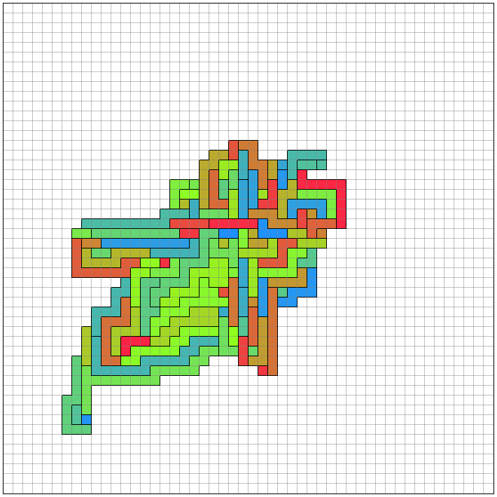

# AHC024

コンテストページ：https://atcoder.jp/contests/ahc024

## 問題概要
グリッドをいくつかの区画に区切ることで表現された地図がある。この地図を、各区画の隣接関係を保ったままなるべく小さな領域で表現したい。

## 順位
122位/提出者729人

## 方針
1. ランダムにマスを選ぶ
2. そのマスの色(そのマスがどの区画に属するか)を外側にある色に変更する
3. 隣接関係が変化しなければその変更を採用、変化した場合は元に戻す
4. 1-3を繰り返す

- 選択されたマスの色の領域の面積が小さくなって外側の領域が内側に来るので、どんどん全体が小さくなっていくことが期待される

実装は[こちら](./main.cpp)
提出結果は[こちら](https://atcoder.jp/contests/ahc024/submissions/45916119)

## 入力例1に対する解

ビジュアライザ：https://img.atcoder.jp/ahc024/AU5KcDyn.html?lang=ja