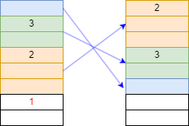

# AHC026

コンテストページ：https://atcoder.jp/contests/ahc026

## 問題概要
AtCoder社の倉庫には n 個のダンボール箱があり、m 個の山に分けて垂直に積まれている。 各箱には 1,⋯,n の番号がちょうど一つずつ書かれており、番号の小さい方から1つずつ順番に倉庫から運び出したい。 ある箱を運び出すためには、その上に積まれている全ての箱を別の山へ移動させておく必要がある。 高橋社長はとても力持ちなので、積み重なった箱を一度に何箱でも持ち上げて動かすことが出来るが、持ち上げる箱の個数に応じて体力を消費してしまう。 出来るだけ体力消費が少なくなるような運び出し方を求めて欲しい。(問題文より引用)

## 順位
180位/提出者789人

## 方針
運び出したい箱より上にある箱たちを別の山に移動させる。移動先は(山にある箱の番号の最小値)が最大となる山とする。  
移動させる際、移動対象とする箱に対して、山の下の方から番号に対する増加部分列を取る。移動先の山で、その増加部分列が逆順の列となるように分けて移動させる。
  
上図は移動の例。このように移動することで番号の小さい箱が上に行くようになる。

実装は[こちら](./main.cpp)
提出結果は[こちら](https://atcoder.jp/contests/ahc026/submissions/47306388)

ビジュアライザ：https://img.atcoder.jp/ahc026/lPQezTZx.html?lang=ja